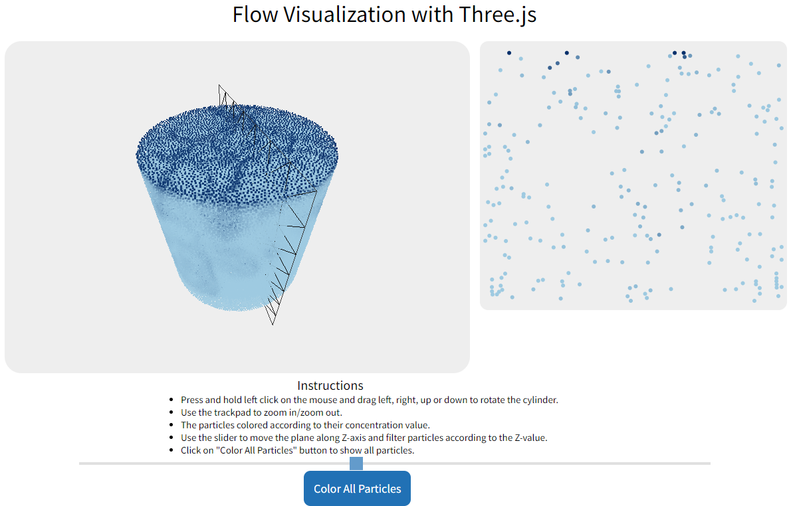
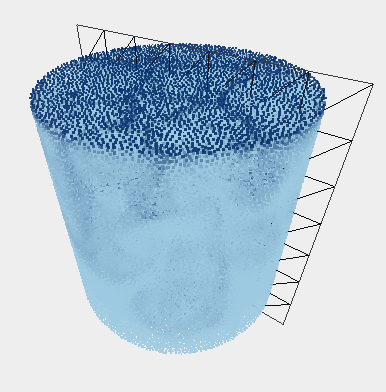
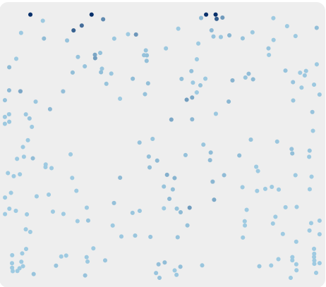

# Flow Visualization with Three.js

This project aims to visualize and analyze computational fluid flow simulation data from the San Diego Supercomputing Center using Three.js and D3.js. The goal is to create an interactive 3D visualization of the flow data, complemented by a linked 2D visualization. This project will provide insights into fluid dynamics while demonstrating various visualization techniques and interactions in a web-based environment.

- __Access this project:__ https://komar41.github.io/Three-JS-Flow/
- __GitHub repo:__ https://github.com/komar41/Three-JS-Flow
- __Tools used:__ - Three.js, D3.js, JavaScript, HTML, CSS

## Project Objectives

- Load and display a 3D point cloud on the web
- Embed a 2D slice visualization within the 3D point cloud using D3.js
- Implement linked views, brushing and linking, view manipulation, and filtering

## Visualization Components

### 1. 3D Point Cloud Visualization

- Display the fluid flow data as a 3D point cloud
- Colormap the point cloud based on concentration values

### 2. 2D Vertical Slice View

- Create a second view using D3.js
- Display a vertical 2D slice of the data (XY slice with fixed Z value)

### 3. Cut-Plane Filter
- Add a vertical XY rectangle filter in the 3D view to link with the 2D slice within the 3D flow
- Allow user to move the rectangle through the flow along the Z axis

### 4. Linked Views
- Link the 3D view and 2D view through the rectangle filter
- Show only the 3D points inside the rectangle in the 2D view

### 5. Brushing and Linking
- Implement brushing and linking
- Gray out all 3D points outside the rectangle cut-plane

## Interaction Features
- Rotate the cylinder containing the flow
- Move the cut-plane filter along the Z axis
- Linked updates between 3D and 2D views

## Data Source
- Computational fluid flow simulation dataset from San Diego Supercomputing Center: http://www.uni-kl.de/sciviscontest/

## Resources
- [Three.js documentation and examples](http://threejs.org/docs/)
- [Stack Overflow](https://stackoverflow.com/)
- [D3 Graph Gallery](https://d3-graph-gallery.com/)